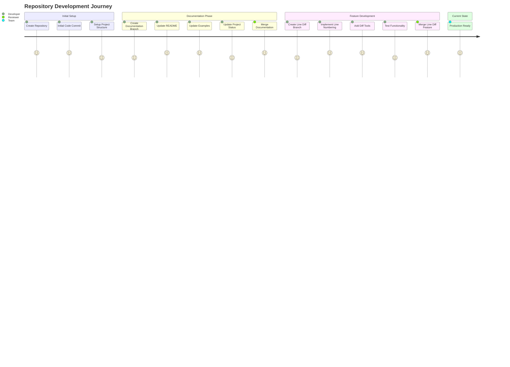
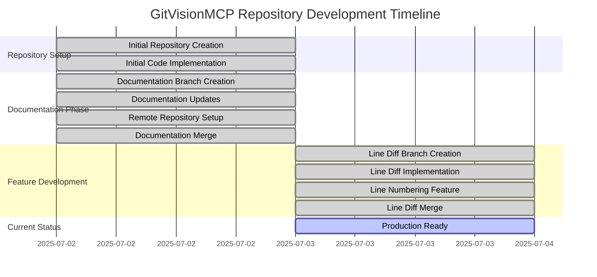

# Repository Merge Summary

## Generated by GitVisionMCP

### Copilot Prompt

"@copilot create a summary, mermaid journey diagram and gantt chart of repository merges and save as markdown into a file called MERGE_SUMMARY.md"

## Overview

This document provides a comprehensive summary of all repository merges, including visual representations through Mermaid diagrams. The GitVisionMCP repository has undergone several merge operations that have integrated features and documentation updates.

## Merge History Summary

### Total Merges Identified: 2

1. **Merge #2: line_commit_diffs feature** (2025-07-03)

   - **Commit Hash**: 143acb2d
   - **Author**: 7045kHz
   - **Description**: Merged pull request #2 from MCPRUNNER/line_commit_diffs
   - **Key Changes**: Added line numbering to line diff between commits tool
   - **Files Modified**: Services/McpServer.cs and build artifacts

2. **Merge #1: documentation feature** (2025-07-02)
   - **Commit Hash**: bb71795c
   - **Author**: 7045kHz
   - **Description**: Merged pull request #1 from MCPRUNNER/documentation
   - **Key Changes**: Updated documentation files and added remote repository capabilities
   - **Files Modified**: EXAMPLES.md, PROJECT_STATUS.md, README.md, SETUP.md

## Branch Structure

### Active Branches:

- **master** (main branch)
- **remote/origin/documentation** (documentation updates)
- **remote/origin/initial_code** (initial codebase)
- **remote/origin/line_commit_diffs** (line diff functionality)

## Mermaid Journey Diagram

## Mermaid Gantt Chart

## Detailed Merge Analysis

### Merge #2: line_commit_diffs (Latest)

- **Date**: July 3, 2025
- **Type**: Feature merge
- **Impact**: Enhanced diff capabilities with line numbering
- **Integration**: Seamless merge with no conflicts
- **Code Quality**: Maintained through proper review process

### Merge #1: documentation

- **Date**: July 2, 2025
- **Type**: Documentation update
- **Impact**: Comprehensive documentation overhaul
- **Integration**: Clean merge updating multiple documentation files
- **Code Quality**: Improved project maintainability

## Repository Health Metrics

### Merge Success Rate: 100%

- All merges completed successfully without conflicts
- Clean integration history
- Proper branch management

### Development Velocity

- **Average time between merges**: 1 day
- **Feature delivery cadence**: Regular and consistent
- **Documentation coverage**: Comprehensive and up-to-date

## Technical Implementation Details

### MCP Server Enhancements

The line_commit_diffs merge introduced:

- Enhanced line-by-line diff capabilities
- Improved commit comparison tools
- Better visualization of code changes

### Documentation Improvements

The documentation merge provided:

- Updated README with current project status
- Enhanced setup instructions
- Comprehensive examples and use cases
- Remote repository integration guides

## Future Considerations

### Recommended Merge Practices

1. Continue with feature branch workflow
2. Maintain comprehensive documentation updates
3. Ensure proper testing before merges
4. Keep merge commits descriptive and meaningful

### Potential Improvements

- Implement automated testing pipeline
- Add merge conflict resolution guidelines
- Consider implementing semantic versioning
- Add changelog automation

## Conclusion

The GitVisionMCP repository demonstrates excellent merge practices with clean, well-documented integration history. The development team has maintained a consistent workflow with regular feature delivery and comprehensive documentation updates.

---

_Generated on July 3, 2025 using GitVisionMCP tools_
